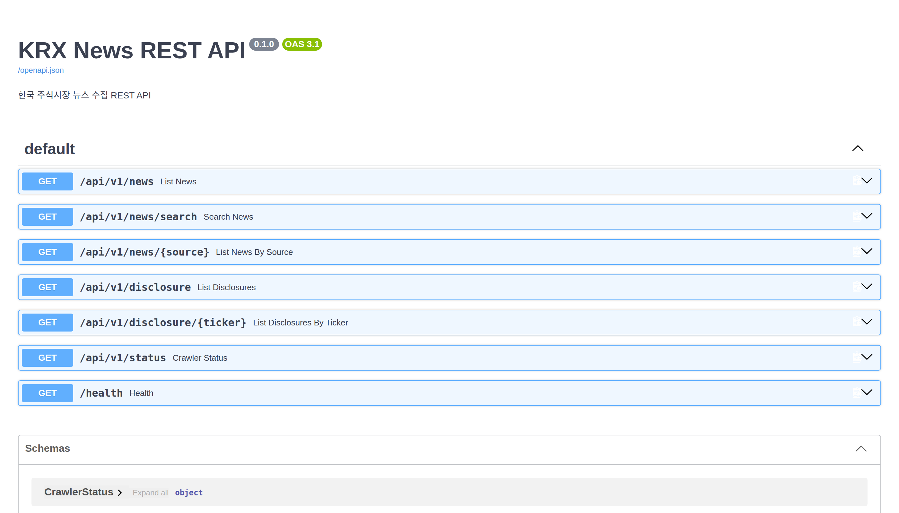

# KRX News REST API

[](https://github.com/younghwan91/krx-news-rest-api/actions/workflows/ci.yml)
[](https://www.python.org/downloads/)
[](https://fastapi.tiangolo.com/)
[](https://github.com/younghwan91/krx-news-rest-api/blob/main/LICENSE)
[](https://www.linkedin.com/in/younghwan-chae/)

**한국 주식시장의 뉴스·공시를 5개 매체에서 모아 하나의 스키마로 내주는 REST API** — KIND, DART, 네이버 금융, 한국경제, 더벨.

매체마다 HTML 구조도 갱신 주기도 제각각이라, 뉴스를 쓰려는 쪽이 매번 크롤러를 다시 짜게 된다. 그 일을 한 번만 하려고 만들었다.



## 빠른 시작

```bash
git clone https://github.com/younghwan91/krx-news-rest-api.git
cd krx-news-rest-api
cp .env.example .env          # DART_API_KEY 는 선택 (없으면 나머지 4개 소스만 돈다)

docker compose up -d          # API + Redis
curl http://localhost:8000/health          # {"status":"ok"}
open http://localhost:8000/docs            # Swagger UI
```

```bash
curl "http://localhost:8000/api/v1/news?page_size=5"
curl "http://localhost:8000/api/v1/news/search?q=삼성전자"
curl "http://localhost:8000/api/v1/disclosure/005930"
```

전체 엔드포인트·응답 형태는 [docs/API.md](docs/API.md), 로컬 개발·환경변수·배포는 [docs/DEVELOPMENT.md](docs/DEVELOPMENT.md).

## 캐시 우선 구조

요청이 올 때 크롤링하면 응답이 매체 사이트 속도에 묶이고, 트래픽이 몰리면 그대로 상대 서버를 때린다. **읽기 경로와 수집 경로를 갈라놨다.**

```
[수집] APScheduler -> 5개 스크래퍼 -> 정규화 -> Redis     (공시 60초 / 뉴스 300초)
[읽기] 클라이언트   -> FastAPI     -> Redis 에서 즉시 응답 (크롤링 대기 없음)
```

API 핸들러는 Redis 만 읽는다. 크롤링은 백그라운드 스케줄러가 자기 주기로 돌고, 실패해도 캐시에 있던 직전 데이터로 계속 응답한다. 소스별 성공/실패는 `/api/v1/status` 에 그대로 노출된다.

수집한 기사는 매체와 무관하게 `NewsArticle`, 공시는 `Disclosure` 한 벌로 정규화한다. 소스가 늘어도 클라이언트 코드는 그대로다.

## 구조

```
src/krx_news_api/
├── main.py         # FastAPI 앱 · 미들웨어 · lifespan
├── routes/news.py  # 엔드포인트 7개
├── models/         # NewsArticle · Disclosure · CrawlerStatus
├── scrapers/       # base(재시도·간격·UA 순환) + 소스 5개
└── services/       # cache(Redis) · scheduler(APScheduler)
```

FastAPI · httpx · BeautifulSoup4 · Redis · APScheduler 로 돌아가고, 테스트는 fakeredis 를 써서 Redis 없이 `pytest` 만으로 통과한다.

## 라이선스

Apache License 2.0 — 전문은 [LICENSE](LICENSE) 참조.
---

## ⭐ 도움이 되셨다면

이 프로젝트가 유용했다면 우측 상단 **[⭐ Star](https://github.com/younghwan91/krx-news-rest-api)** 를 눌러주세요. 검색·추천 노출이 올라가 더 많은 분들이 찾을 수 있습니다.

- 🐛 버그·질문 → [Issues](https://github.com/younghwan91/krx-news-rest-api/issues)
- 📈 업데이트 소식 → [팔로우 @younghwan91](https://github.com/younghwan91)

## 관련 프로젝트 — 오픈소스 퀀트 스택

한국·미국 주식과 암호화폐를 아우르는 오픈소스 스택입니다. 각 저장소는 독립적으로 쓸 수 있습니다.

| 축 | 프로젝트 | 설명 |
|---|---|---|
| 🇰🇷 한국 주식 | **[kiwoom-rest-api](https://github.com/younghwan91/kiwoom-rest-api)** | 키움증권 REST API Python 라이브러리 — 국내주식 엔드포인트 전수·실시간 WebSocket, sync + async (`pip install kiwoom-client`) |
| 🇰🇷 한국 주식 | **[krx-fundamentals-api](https://github.com/younghwan91/krx-fundamentals-api)** | 국내 기업 펀더멘탈 REST API — 재무제표·투자지표·배당·종목 스크리닝 (DART + KRX + 네이버) |
| 🇰🇷 한국 주식 | **[quant-airflow](https://github.com/younghwan91/quant-airflow)** | 시세·수급·실적을 TimescaleDB 로 수집하는 Airflow 파이프라인 — 상장폐지 종목까지 담아 생존편향을 막는다 |
| 🇰🇷 한국 주식 | **[kr-quant](https://github.com/younghwan91/kr-quant)** | 코스피·코스닥 알파 리서치 — walk-forward·랜덤 음성대조·purged CV·Deflated Sharpe 를 CI 가드레일로 강제 |
| 🇺🇸 미국 주식 | **[portfolio-research](https://github.com/younghwan91/portfolio-research)** | 미국주식 팩터 엔진 — point-in-time·생존편향 보정 데이터 위에서 walk-forward 를 Deflated Sharpe·PBO 로 게이팅 (+ ETF 전술배분 TAA — 9개 사전등록, 채택 0) |
| 🇺🇸 미국 주식 | **[automated-stock-trading-systems](https://github.com/younghwan91/automated-stock-trading-systems)** | Bensdorp 의 7개 비상관 트레이딩 시스템 백테스터 (교육용 재구현) |
| ₿ 암호화폐 | **[quantbox-engine](https://github.com/younghwan91/quantbox-engine)** | 암호화폐 선물 백테스트·실행 엔진 — 룩어헤드 0, 백테스트↔실거래 일체화 |

## 만든 사람

**채영환 (Younghwan Chae)** · [GitHub @younghwan91](https://github.com/younghwan91) · [LinkedIn](https://www.linkedin.com/in/younghwan-chae/)

전체 오픈소스 퀀트 스택은 [프로필](https://github.com/younghwan91)에서 한눈에 볼 수 있습니다.
